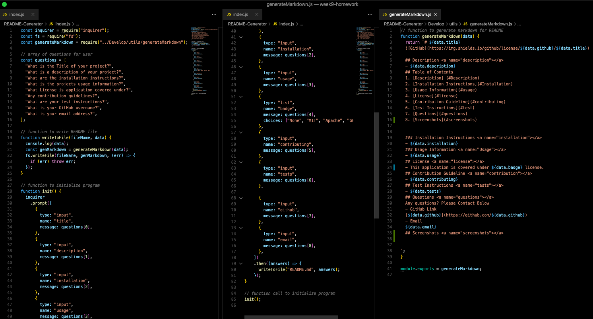

# README_GENERATOR

## Description 

- This will generate a **good** README for your next project. Its so simple , I promise, you'll be creating README's in half the time.

## Table of Contents

1. [Description](#Description)
2. [Installation Instructions](#Installation)
3. [Usage Information](#usage)
4. [License](#license)
5. [Contribution Guideline](#contributing)
6. [Test Instructions](#test)
7. [Questions](#questions)
8. [Screenshots](#screenshots)

### Installation Instructions 

- To install you would copy the **ssh** or **https** link and clone in your terminal. In the repo using terminal and type "npm i" to install the **package.json** & **node modules**.

### Usage Information 

- Using **node**, type "node index.js" to start. You will be asked 7 questions and the program will create a simple yet informative README.

## License 

- This application is covered under **MIT** license.

## Contribution Guideline 

- Fork the project , and work to improve code or program itself.

## Test Instructions 

- Type "npm run test" for **jest** to run a test on the functions.

## Questions 

Any questions? Please Contact Below

- **GitHub Link:**
  [melanietorres425](https://github.com/melanietorres425)
- **Email:**
  melanietorres425@live.com

## Screenshots 

